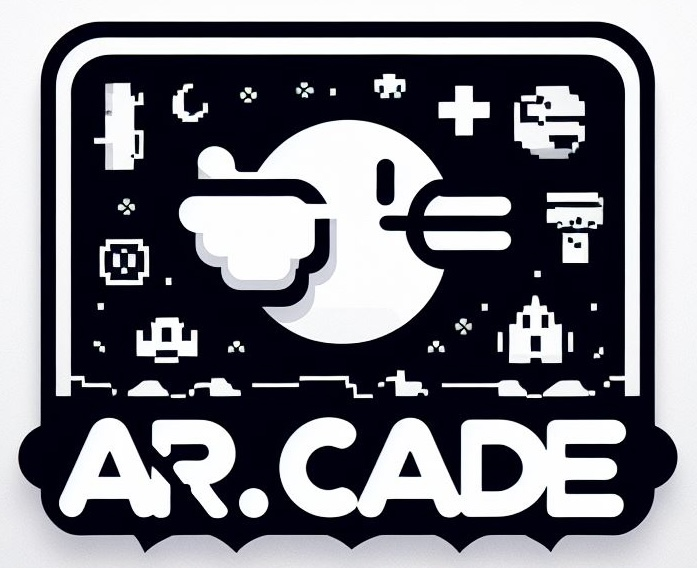

## Inspiration
Video games evolved when the Xbox Kinect was released in 2010 but for some reason we reverted back to controller based games. We are here to bring back the amazingness of movement controlled games with a new twist- re innovating how mobile games are played!

## What it does
AR.cade uses a body part detection model to track movements that correspond to controls for classic games that are ran through an online browser. The user can choose from a variety of classic games such as temple run, super mario, and play them with their body movements. 

## How we built it
- The first step was setting up opencv and importing the a body part tracking model from google mediapipe
- Next, based off the position and angles between the landmarks, we created classification functions that detected specific movements such as when an arm or leg was raised or the user jumped. 
- Then we correlated these movement identifications to keybinds on the computer. For example when the user raises their right arm it corresponds to the right arrow key
- We then embedded some online games of our choice into our front and and when the user makes a certain movement which corresponds to a certain key, the respective action would happen
- Finally, we created a visually appealing and interactive frontend/loading page where the user can select which game they want to play

## Challenges we ran into
A large challenge we ran into was embedding the video output window into the front end. We tried passing it through an API and it worked with a basic plane video, however the difficulties arose when we tried to pass the video with the body tracking model overlay on it

## Accomplishments that we're proud of
We are proud of the fact that we are able to have a functioning product in the sense that multiple games can be controlled with body part commands of our specification. Thanks to threading optimization there is little latency between user input and video output which was a fear when starting the project.

## What we learned
We learned that it is possible to embed other websites (such as simple games) into our own local HTML sites. 

We learned how to map landmark node positions into meaningful movement classifications considering positions, and angles. 

We learned how to resize, move, and give priority to external windows such as the video output window

We learned how to run python files from JavaScript to make automated calls to further processes 

## What's next for AR.cade
The next steps for AR.cade are to implement a more accurate body tracking model in order to track more precise parameters. This would allow us to scale our product to more modern games that require more user inputs such as Fortnite or Minecraft.
